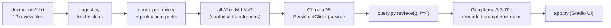

# Project 1 Planning: The Unofficial Guide

> Spec written before pipeline code. Update the Retrieval Approach and Chunking Strategy sections if the approach changes during implementation, and update this file before starting any stretch features.

---

## Domain

Student reviews of **professors at CUNY Hunter College** — the Rate My Professor-style knowledge students actually rely on when picking a section. The official course catalog tells you a course's title and credits, but not whether the exams come from the slides or the textbook, how heavy the weekly workload really is, whether a professor curves, or whether attendance is quietly half your grade. That practical, experience-based knowledge is scattered across review sites, group chats, and word of mouth, and it is exactly what this system makes searchable and answerable with citations.

> Data note: For this educational project the corpus is **synthetic**. Reviews use fictional professor names paired with real Hunter departments and course codes (CSCI 135, MATH 155, ENGL 120, etc.). Each file is explicitly labeled as synthetic so no fabricated opinions are attributed to real, identifiable people. The pipeline is identical to one run on real collected reviews.

---

## Documents

12 plain-text files in `documents/`, one professor per file, 5-6 student reviews each. Each review carries a Rating / Difficulty / Would-take-again line plus free-text opinion. Sources span six departments and a spread of sentiment (easy gen-eds, brutal CS projects, tough writing graders) so the corpus answers a range of questions rather than repeating one opinion.

| # | Source | Description | URL or location |
|---|--------|-------------|-----------------|
| 1 | rivera_csci135.txt | CS intro programming; exams from slides, curving | documents/rivera_csci135.txt |
| 2 | zhang_csci235.txt | CS data structures; heavy C++ projects, nickname "Z" | documents/zhang_csci235.txt |
| 3 | chen_math155.txt | Calculus I; heavy WebAssign workload | documents/chen_math155.txt |
| 4 | petrova_math160.txt | Intro statistics; R labs, open-note, easy | documents/petrova_math160.txt |
| 5 | alvarez_engl120.txt | Expository writing; tough essay grader, heavy reading | documents/alvarez_engl120.txt |
| 6 | okafor_psych100.txt | Intro psych; multiple-choice exams, attendance quizzes | documents/okafor_psych100.txt |
| 7 | kim_biol100.txt | Human biology; memorization + lab reports | documents/kim_biol100.txt |
| 8 | bennett_eco200.txt | Principles of econ; dry lectures, easy A | documents/bennett_eco200.txt |
| 9 | obrien_hist151.txt | US history; heavy reading, essay-only exams | documents/obrien_hist151.txt |
| 10 | goldstein_philo101.txt | Intro philosophy; Socratic, papers not exams | documents/goldstein_philo101.txt |
| 11 | hassan_soc101.txt | Intro sociology; papers + participation, easy | documents/hassan_soc101.txt |
| 12 | lang_anthc101.txt | Cultural anthropology; reading-heavy, fieldwork paper | documents/lang_anthc101.txt |

---

## Chunking Strategy

**Chunk size:** One review per chunk (variable length, ~230-350 characters in practice), with a hard cap of 600 characters before a long review is windowed.

**Overlap:** 80 characters, applied only when a single review exceeds the 600-char cap.

**Reasoning:** These documents are short, opinion-based reviews where each review is already a complete, self-contained thought ("exams come from the slides, midterm is curved"). The natural retrieval unit is therefore the review, not an arbitrary character window — splitting "every 500 characters" would cut a single reviewer's point in half and merge two reviewers' unrelated opinions. Chunking on review boundaries keeps each embedding focused on one coherent opinion, which is what makes similarity search precise. Each chunk is prefixed with `[Professor <Name>, <Course>]` so it stays self-contained for both retrieval (the professor/course is part of the embedded text) and source attribution. Overlap matters only for the rare long review, where a fact near a split would otherwise be lost; for normal reviews there is nothing to overlap because the whole review is one chunk. Too-small chunks (a sentence fragment) would lose the rating/context; too-large chunks (a whole file) would dilute a specific query across six unrelated opinions.

---

## Retrieval Approach

**Embedding model:** `all-MiniLM-L6-v2` via `sentence-transformers`, run locally (no API key, no rate limits). Embeddings are L2-normalized and stored in ChromaDB with cosine distance.

**Top-k:** 4. With ~5-6 reviews per professor, k=4 pulls in enough independent opinions to capture agreement/disagreement without dragging in reviews of other professors.

**Production tradeoff reflection:** all-MiniLM-L6-v2 is 384-dim, fast, and free, which is ideal for a local class project. If deploying for real users with cost off the table, I'd weigh: (1) **accuracy on domain text** — a larger model like `bge-large-en-v1.5` or an API model (OpenAI `text-embedding-3-large`) would better separate near-duplicate opinions; (2) **context length** — MiniLM truncates at 256 tokens, fine for short reviews but limiting for long-form guides, so a longer-context model would matter if documents grew; (3) **multilingual support** — Hunter is very multilingual, so reviews in Spanish/Chinese would need a multilingual model (`paraphrase-multilingual-MiniLM` or Cohere multilingual); (4) **latency vs. local control** — API embeddings add network latency and a data-privacy concern (sending student reviews to a third party) that local models avoid.

---

## Evaluation Plan

| # | Question | Expected answer |
|---|----------|-----------------|
| 1 | What do students say about Professor Rivera's exams in CSCI 135? | Exams come almost entirely from lecture slides (not the textbook); attendance/redoing in-class examples matters most; midterm is curved, final is not. |
| 2 | Is Professor Chen's MATH 155 a heavy workload? | Yes — weekly WebAssign (30-40 problems) is heavy but consistent, ~25% of grade, mirrors exams. Hard but fair. |
| 3 | Do students recommend Professor Alvarez for ENGL 120? | Generally yes — engaging discussions, improves your writing, but a tough essay grader with heavy reading/writing; revisions and office hours are key. |
| 4 | How are exams graded in Professor Okafor's PSYCH 100? | Three non-cumulative multiple-choice exams, plus short attendance quizzes and one APA paper; predictable and easy if you show up. |
| 5 | What are Professor Z's projects like in CSCI 235? | "Z" = Prof. Wenjie Zhang. Four large C++ projects (linked list, hash table, BST), graded strictly on style/memory leaks, weighted above exams, no late submissions. (Stress test: query uses the nickname, not the indexed surname.) |

---

## Anticipated Challenges

1. **Nickname / out-of-vocabulary terms:** Students refer to professors by nicknames (e.g., "Z" for Zhang). Because the embedded text and metadata use the formal name, a query phrased with the nickname has weaker semantic overlap, so retrieval distances rise and an off-topic chunk can sneak into the top-k (and therefore into the cited sources). This is the engineered failure case.

2. **Mixed sentiment within one professor:** Each professor has both glowing and negative reviews. Retrieval may return a one-sided slice of opinions, making the generated answer skew more positive or negative than the corpus as a whole. The system must summarize disagreement rather than pick a side.

3. **Spurious source attribution:** Because sources are derived from whatever chunks survive the distance filter, a single loosely-related chunk from the wrong professor's file pollutes the "Retrieved from" list even when the answer text is correct.

---

## Architecture

Stages: **Document Ingestion** (`ingest.py`) → **Chunking** (`ingest.py`, review-level) → **Embedding + Vector Store** (`embed_store.py`, all-MiniLM-L6-v2 + ChromaDB) → **Retrieval** (`query.py`, top-k cosine) → **Generation** (`query.py`, Groq llama-3.3-70b-versatile) → **Interface** (`app.py`, Gradio).

---

## AI Tool Plan

**Milestone 3 — Ingestion and chunking:** Give the AI the Documents + Chunking Strategy sections of this file and the file format (header line, blank-line-separated reviews). Ask it to implement `load_documents()`, `clean_text()`, and `chunk_documents()` that split on review boundaries, prefix each chunk with professor/course, window only reviews over 600 chars with 80-char overlap, and attach `{source, professor, course, chunk_index}` metadata. Verify by printing the chunk count and 5 samples and confirming each is self-contained.

**Milestone 4 — Embedding and retrieval:** Give the AI the Retrieval Approach section and the architecture diagram. Ask it to implement `embed_store.py` (embed chunks with all-MiniLM-L6-v2, upsert into a persistent ChromaDB collection with cosine space and metadata) and `retrieve(query, k=4)` returning chunks + metadata + distances. Verify by running 3 eval queries and checking distances are below 0.5 and sources are correct.

**Milestone 5 — Generation and interface:** Give the AI the grounding requirement (answer only from retrieved context; exact refusal string when insufficient), the desired output shape (`{answer, sources, chunks, distances}`), and the Gradio skeleton. Ask it to implement `ask()` with a strict system prompt and to append sources programmatically from metadata. Verify by checking a grounded answer cites the right file and an out-of-scope question triggers the refusal.
